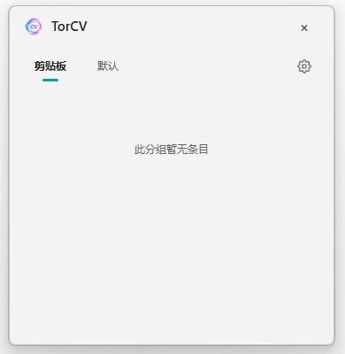
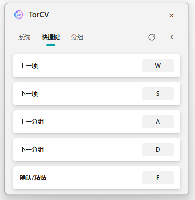
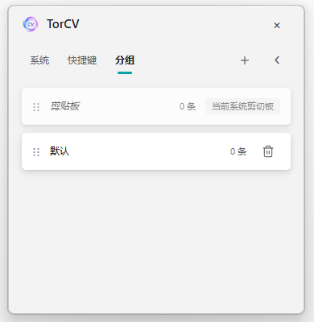
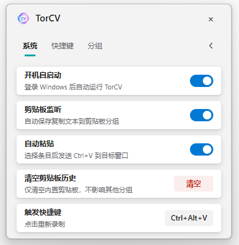

<div align="center">
  <h1>
    TorCV
  </h1>

  <p align="center">
    <a href="https://github.com/Yskysoar/TorCV"></a>
    <a href="https://github.com/Yskysoar/TorCV/blob/main/package.json"></a>
    <a href="https://github.com/Yskysoar/TorCV/blob/main/LICENSE"></a>
    <a href="https://github.com/Yskysoar/TorCV/stargazers"></a>
  </p>

  <h3><a href="README.md">简体中文</a> | English</h3>

  <p>
    A local Windows clipboard text manager for sync, quick switching, and custom groups.
  </p>
</div>

## Highlights

- [x] Sync clipboard content into built-in history
- [x] One-hand keyboard flow for group switching, item selection, and paste
- [x] Custom global shortcut and panel navigation keys
- [x] Custom text groups and item content

## Preview

### Main Panel



### Clipboard Sync


### Shortcuts



### Group Management



### Settings



## What it does

- Sync clipboard content into the built-in clipboard group.
- Switch groups, select text, and paste with one hand.
- Create custom groups and edit custom text items.
- The settings page is keyboard-friendly too.
- Clipboard history can be cleared from settings.
- Duplicate clipboard text is kept as a single entry.
- Previously saved and later cleared text will not be duplicated when copied again.
- Optional auto-paste sends `Ctrl+V` to the previous active window.
- The distributed build is a single exe and works out of the box.

## Use Cases

- Daily copy/paste work
- Multi-group text management
- One-hand group switching and pasting
- Vibe coding, where the same prompts, code snippets, and notes are pasted repeatedly

## Quick Start

### Direct Use

Download the release exe and run it directly. No installation or extra configuration is required.

### Development

Development requires Node.js 20 or newer and npm.

```powershell
npm install
npm run lint
npm run typecheck
npm test
npm start
```

### Build

```powershell
npm run dist
```

## License

See [LICENSE](LICENSE).

## Star History

<p align="center">
  <a href="https://star-history.com/#Yskysoar/TorCV&Date">
    <picture>
      <source media="(prefers-color-scheme: dark)" srcset="https://api.star-history.com/svg?repos=Yskysoar/TorCV&type=Date&theme=dark" />
      <source media="(prefers-color-scheme: light)" srcset="https://api.star-history.com/svg?repos=Yskysoar/TorCV&type=Date" />
      
    </picture>
  </a>
</p>
